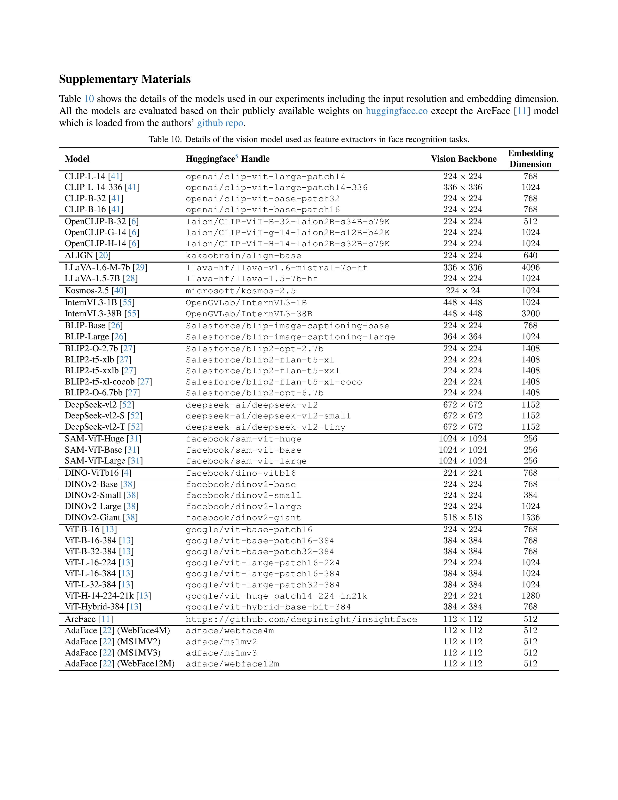
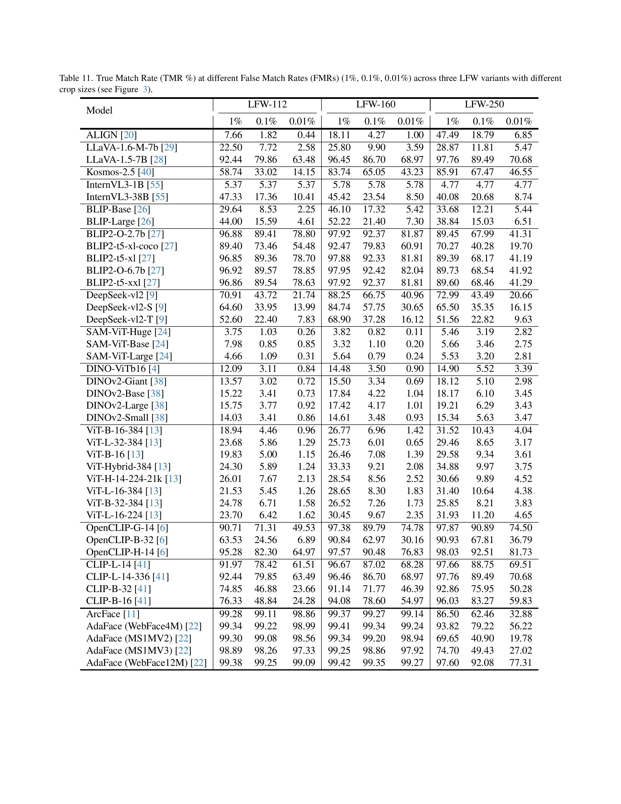
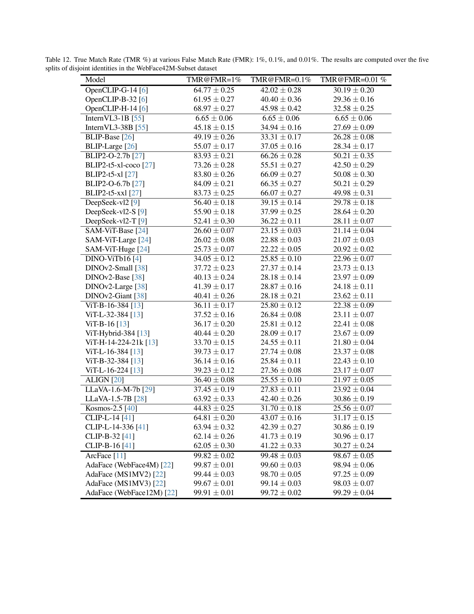
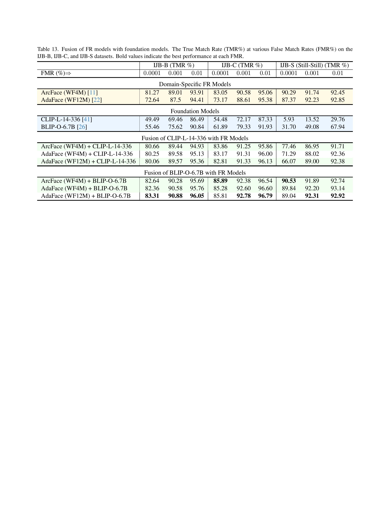
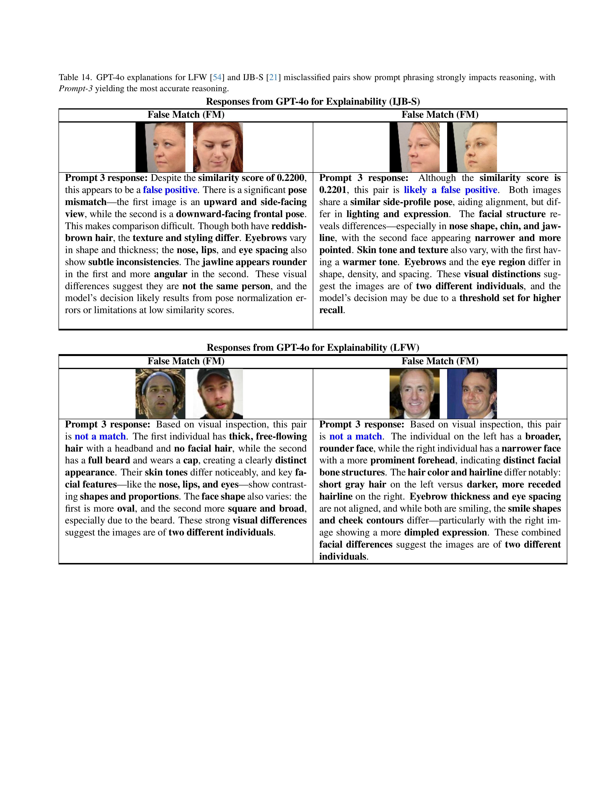
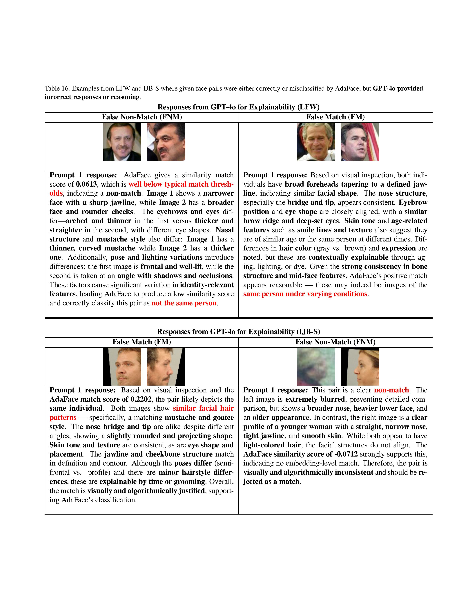
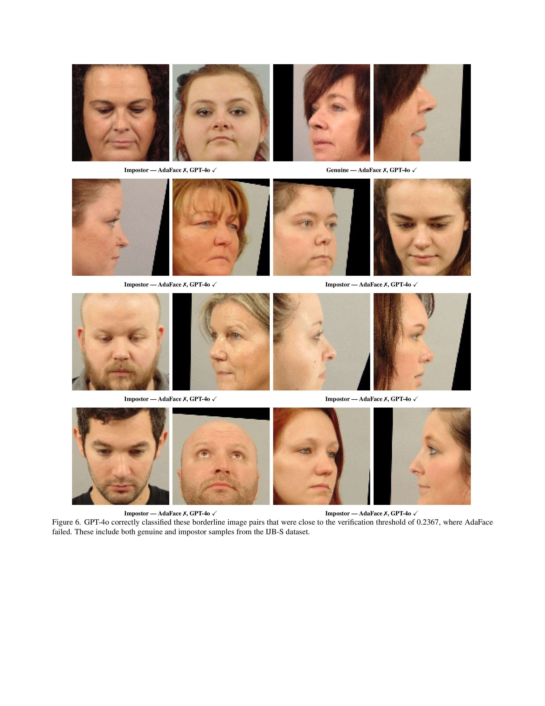

<div align="center">
  
# **Foundation versus Domain-specific Models: Performance Comparison, Fusion, and Explainability in Face Recognition**  

 </div>

<!-- 






 -->

## Reproducing Results

To reproduce the experimental results presented in this work, use the following evaluation scripts for different datasets and model configurations.

### Dataset Evaluation Script

The following bash script runs evaluation across multiple datasets (LFW-112, LFW-160, LFW-250, and WebFace4M) for all model architectures:

```bash
#!/bin/bash

# Set CPU thread limits for optimal performance
CPU_COUNT=6
export OMP_NUM_THREADS=$CPU_COUNT
export OPENBLAS_NUM_THREADS=$CPU_COUNT
export MKL_NUM_THREADS=$CPU_COUNT
export VECLIB_MAXIMUM_THREADS=$CPU_COUNT
export NUMEXPR_NUM_THREADS=$CPU_COUNT

# Define datasets to evaluate
DATASETS=('LFW-112' 'LFW-160' 'LFW-250' 'webface4m')

# Function to run evaluation for all datasets
run_evaluation() {
    local model_name=$1
    for DATASET_NAME in "${DATASETS[@]}"; do
        echo "Evaluating $model_name on $DATASET_NAME"
        python evaluate_only.py --model_name "$model_name" --dataset_name "$DATASET_NAME"
    done
}

# SAM (Segment Anything Model) variants
echo "=== Evaluating SAM Models ==="
run_evaluation "facebook/sam-vit-huge"
run_evaluation "facebook/sam-vit-base"
run_evaluation "facebook/sam-vit-large"

# DINOv2 and DINO variants
echo "=== Evaluating DINO Models ==="
run_evaluation "facebook/dinov2-giant"
run_evaluation "facebook/dinov2-base"
run_evaluation "facebook/dinov2-small"
run_evaluation "facebook/dinov2-large"

run_evaluation "facebook/dino-vitb16"

# Vision-Language Models (VLMs)
echo "=== Evaluating Vision-Language Models ==="
run_evaluation "kakaobrain/align-base"
run_evaluation "OpenGVLab/InternVL3-1B"
run_evaluation "OpenGVLab/InternVL3-38B"
run_evaluation "microsoft/kosmos-2-patch14-224"

run_evaluation "deepseek-ai/deepseek-vl2"
run_evaluation "deepseek-ai/deepseek-vl2-small"
run_evaluation "deepseek-ai/deepseek-vl2-tiny"

# CLIP variants
echo "=== Evaluating CLIP Models ==="
run_evaluation "openai/clip-vit-large-patch14"
run_evaluation "openai/clip-vit-large-patch14-336"
run_evaluation "openai/clip-vit-base-patch32"
run_evaluation "openai/clip-vit-base-patch16"

# BLIP variants
echo "=== Evaluating BLIP Models ==="
run_evaluation "Salesforce/blip-image-captioning-base"
run_evaluation "Salesforce/blip2-flan-t5-xxl"
run_evaluation "Salesforce/blip2-opt-6.7b"
run_evaluation "Salesforce/blip-image-captioning-large"

run_evaluation "Salesforce/blip2-opt-2.7b"
run_evaluation "Salesforce/blip2-flan-t5-xl-coco"
run_evaluation "Salesforce/blip2-flan-t5-xl"

# OpenCLIP variants
echo "=== Evaluating OpenCLIP Models ==="
run_evaluation "LAION/OpenCLIP-Huge"
run_evaluation "LAION/OpenCLIP-Base"
run_evaluation "LAION/OpenCLIP-Giant"

# Vision Transformer (ViT) variants
echo "=== Evaluating ViT Models ==="
run_evaluation "google/vit-large-patch32-384"
run_evaluation "google/vit-base-patch16-224"
run_evaluation "google/vit-hybrid-base-bit-384"
run_evaluation "google/vit-base-patch16-384"

run_evaluation "google/vit-huge-patch14-224-in21k"
run_evaluation "google/vit-large-patch16-384"
run_evaluation "google/vit-base-patch32-384"
run_evaluation "google/vit-large-patch16-224"

# Domain-specific Face Recognition Models
echo "=== Evaluating Face Recognition Models ==="
run_evaluation "afrs/arcface_ir101_webface4m"
run_evaluation "afrs/adaface_ir101_webface4m"
run_evaluation "afrs/adaface_ir101_ms1mv2"
run_evaluation "afrs/adaface_ir101_ms1mv3"

run_evaluation "afrs/adaface_ir101_webface12m"

# LLaVA variants
echo "=== Evaluating LLaVA Models ==="
run_evaluation "llava-hf/llava-v1.6-mistral-7b-hf"
run_evaluation "llava-hf/llava-1.5-7b-hf"

echo "=== All evaluations completed ==="
```

### Single Dataset Evaluation

For evaluating on a specific dataset, modify the `DATASETS` array or set a single dataset:

```bash
#!/bin/bash

# Example: Evaluate only on LFW-112
DATASET_NAME='LFW-112'

CPU_COUNT=6
export OMP_NUM_THREADS=$CPU_COUNT
export OPENBLAS_NUM_THREADS=$CPU_COUNT
export MKL_NUM_THREADS=$CPU_COUNT
export VECLIB_MAXIMUM_THREADS=$CPU_COUNT
export NUMEXPR_NUM_THREADS=$CPU_COUNT

# Example: Run specific model evaluation
python evaluate_only.py --model_name "afrs/adaface_ir101_webface12m" --dataset_name $DATASET_NAME
```

### Usage Instructions

1. **Prerequisites**: Ensure all required dependencies are installed and datasets are properly configured
2. **Dataset Setup**: Verify that dataset paths in `config.py` point to the correct locations
3. **Model Access**: Ensure proper authentication for Hugging Face models if required
4. **Execution**: Run the evaluation script from the project root directory
5. **Results**: Evaluation results will be saved in the `extracted_features/` directory
6. **Summary**: Use `python summarize_scores.py --dataset_name <dataset_name>` to generate summary reports

### Expected Output Structure

```
extracted_features/
├── LFW-112/
├── LFW-160/
├── LFW-250/
└── webface4m/
    └── verification/
        └── <model_family>/
            └── <model_name>/
                ├── split_1_tmr_results.csv
                ├── split_2_tmr_results.csv
                ├── split_3_tmr_results.csv
                ├── split_4_tmr_results.csv
                └── split_5_tmr_results.csv
```
