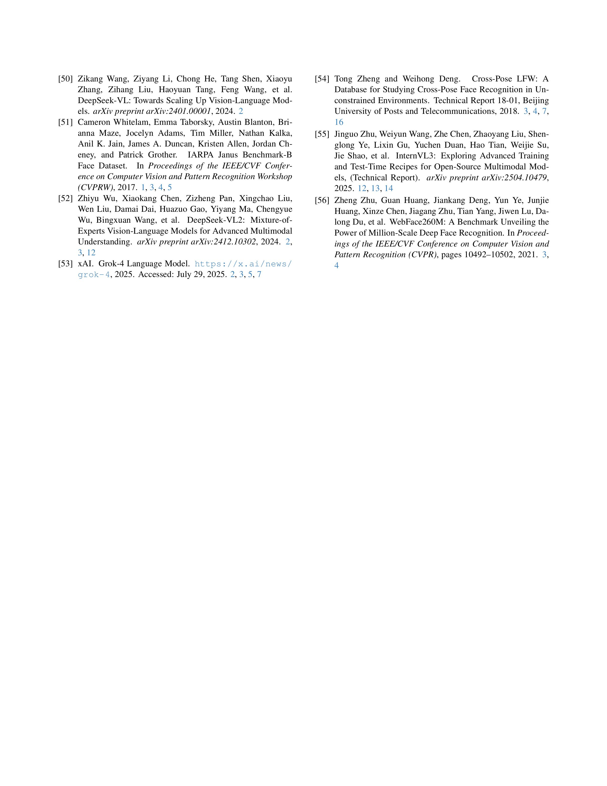

  
  
  

---

## 📝 Abstract
In this paper, we address the following question: How do generic foundation models (e.g., CLIP, BLIP, GPT-4o) compare against a domain-specific face recognition model (viz., AdaFace or ArcFace) on the face recognition task? Through a series of experiments involving several foundation models and benchmark datasets, we report the following findings: (a) In all face benchmark datasets considered, domain-specific models outperformed zero-shot foundation models. (b) The performance of zero-shot generic foundation models improved on over-segmented face images compared to tightly cropped faces, thereby suggesting the importance of contextual clues. (c) A simple score-level fusion of a foundation model with a domain-specific face recognition model improved the accuracy at low false match rates. (d) Foundation models, such as GPT-4o, are able to provide explainability to the face recognition pipeline. In some instances, foundation models are even able to resolve low-confidence decisions made by AdaFace,  thereby reiterating the importance of combining domain-specific face recognition models with generic foundation models in a judicious manner. 

---

## Supplementary Materials: 

